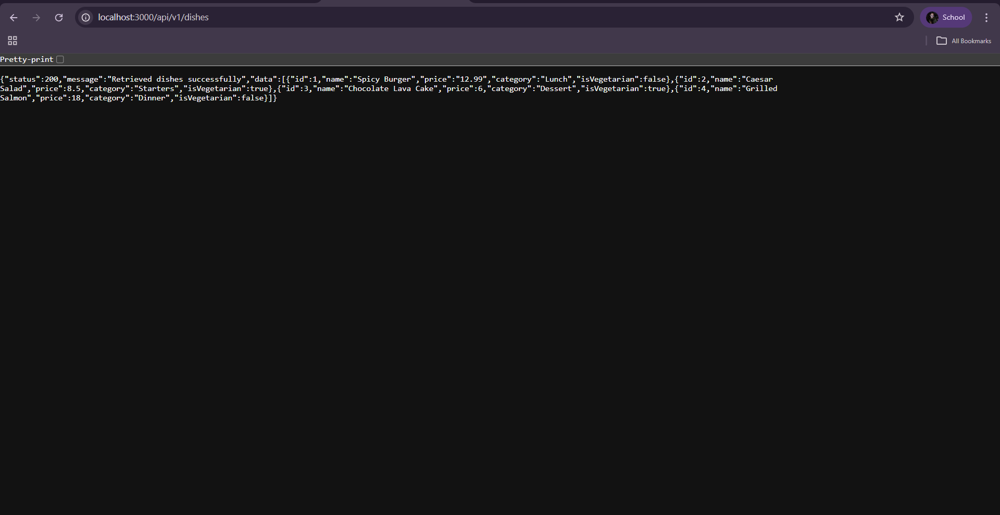

Markdown
# RESTful API Activity - [PanlilioRonaJ._3D]

## Best Practices Implementation
**1. Environment Variables:**
 - Why did we put `BASE_URI` in `.env` instead of hardcoding it?
 - Answer: 
        Storing `BASE_URI` in a `.env` file allows us to easily change the API endpoint without modifying the code. It also keeps sensitive information, like API keys, secure and prevents accidental exposure when sharing code.

**2. Resource Modeling:**
 - Why did we use plural nouns (e.g., `/dishes`) for our routes?
 - Answer: 
        Plural nouns represent collections of resources, which makes the API more intuitive. For example, `/dishes` clearly indicates a list of dish objects, while `/dish` could suggest a single item, causing confusion.

**3. Status Codes:**
 - When do we use `201 Created` vs `200 OK`?
 - Answer:
        `201 Created` is used when a new resource is successfully created (like after a POST request). `200 OK` is used for successful retrieval, update, or deletion of existing resources. 

 - Why is it important to return `404` instead of just an empty array or a generic error?
 - Answer: 
        Returning `404 Not Found` accurately informs the client that the requested resource does not exist, preventing ambiguity. An empty array or generic error could mislead the client into thinking the request succeeded but no data exists, which can lead to logical errors in the application. 

**4. Testing:**
 - (Paste a screenshot of a successful GET request here)
 

 ## Hands-on Activity #3: Advanced Data Modeling
 - "Why did I choose to Embed the [Review/Tag/Log]?"
     - A review is conceptually like an item in a backpack; it always belongs to the parent dish and has no use being stored alone. Storing them inside the Dish document makes it faster to load everything at once without searching through a separate "Reviews" collection.

 - "Why did I choose to Reference the [Chef/User/Guest]?"
     - A Chef exists as a separate entity. They still exist in our database even if they aren't currently cooking a specific dish. Multiple dishes can share the same Chef. By using a reference, I don't have to copy the Chef's name into every single dish. If the Chef's specialty changes, I only update it once in the Chef model.

## Hands-on Activity #4: Securing the API
**1. Authentication vs Authorization:**
What is the difference between Authentication and Authorization in our code?
- Answer:
    - Authentication is the process of verifying the identity of a user, such as logging in with an email and password. Authorization is the process of checking what actions the user is allowed to perform, like whether a role can access, create, update, or delete data. Authentication occurs first, and then authorization ensures the user has permission for the requested action.

**2. Security (bcrypt):**
Why did we use bcryptjs instead of saving passwords as plain text in MongoDB?
- Answer: 
     - We use bcryptjs to hash passwords so that plain text passwords are never stored in the database. This keeps user passwords safe if the database is hacked.

**3. JWT Structure:**
What does the protect middleware do when it receives a JWT from the client?
- Answer: 
     - The protect middleware takes the JWT token from the user, checks if it’s valid, and then allows access to the route if the token is correct. It also attaches 
    the user info to the request so the route knows who is making the request.
